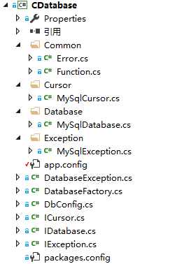

# 欢迎使用最简单的基于.Net的数据库分装类

[](https://travis-ci.org/taowenyin/CDatabase) [](https://ci.appveyor.com/project/taowenyin/cdatabase)

## 1. 程序目录结构



> * Common：公共程序
> 1. Error.cs：数据库操作错误码和错误信息
> 2. Function.cs：通用函数
> * Cursor：各类数据库的游标类
> * Database：各类数据库的派生类
> * Exception：各类数据库异常的派生类
> * DatabaseException.cs：统一的数据库异常类
> * DatabaseFactory.cs：数据库工厂类，产生各类数据库对象
> * DbConfig.cs：数据库的配置类
> * ICursor.cs：数据库游标接口
> * IDatabase.cs：数据库接口
> * IException.cs：异常接口

## 2. 支持的数据库

| 数据库 | 第三方库版本 | .Net版本 |
| :----: | :----: | :----: |
| MySQL | 6.9.9 | 4.0, 4.5 |

## 3. 引入第三方库

#### 方法一：通过Vistual Studio自带的NuGet包管理工具引用第三方库

#### 方法二：通过项目引用第三方DLL库

> 右键项目->添加->引用->浏览(B)...->选择需要的DLL->确定

## 4. 使用方法

#### Step1：通过工厂产生数据库对象

```CSharp
using CDatabase;

DbConfig config = new DbConfig();
config.Server = "localhost";
config.User = "root";
config.Password = "root";
config.Port = 3306;
config.Database = "test";

IDatabase database = DatabaseFactory.CreateDatabase(config, DbConfig.DbType.MYSQL);
```

#### Step2：开发数据库

```CSharp
using CDatabase;

try
{
    database.Open();
}
catch (DatabaseException e)
{
    Console.WriteLine("错误代码：" + e.GetErrorCode() + "，错误信息：" + e.GetErrorMsg());
}
```

#### Step3：数据库操作

1. 执行一条SQL语句

```CSharp
/// <summary>
/// 执行一条SQL语句，
/// </summary>
/// <param name="sql">SQL语句，可以使用?做为占位符</param>
/// <param name="bindArgs">用于替换占位符的数组</param>
/// <returns>执行SQL语句影响的行数</returns>
int ExecSQL(string sql, string[] bindArgs);

/// <summary>
/// 执行SQL文件
/// </summary>
/// <param name="info">SQL文件对象</param>
/// <returns>执行SQL语句影响的行数</returns>
int ExecSQL(FileInfo info);
```

2. 向数据库插入数据

```CSharp
/// <summary>
/// 执行一条插入语句
/// </summary>
/// <param name="table">数据表名称</param>
/// <param name="nullColumnHack">插入NULL值的字段</param>
/// <param name="values">添加的字段</param>
/// <returns>返回新数据的主键ID</returns>
long Insert(string table, string nullColumnHack, Dictionary<string, string> values);
```

3. 向数据库更新数据

```CSharp
/// <summary>
/// 执行一条更新语句
/// </summary>
/// <param name="table">数据表名称</param>
/// <param name="values">新的数据值</param>
/// <param name="whereClause">条件语句，可以使用?作为占位符</param>
/// <param name="whereArgs">替换占位符的条件参数</param>
/// <returns>更新数据影响的行数</returns>
int Update(string table, Dictionary<string, string> values, string whereClause, string[] whereArgs);
```

4. 向数据库删除数据

```CSharp
/// <summary>
/// 执行一条删除语句
/// </summary>
/// <param name="table">数据表名称</param>
/// <param name="whereClause">条件语句，可以使用?作为占位符</param>
/// <param name="whereArgs">替换占位符的条件参数</param>
/// <returns>删除数据影响的行数</returns>
int Delete(string table, string whereClause, string[] whereArgs);
```

4. 数据库查询

```CSharp
/// <summary>
/// 执行一条查询语句
/// </summary>
/// <param name="distinct">是否过滤重复值</param>
/// <param name="table">数据表名称</param>
/// <param name="columns">查询字段，如果为NULL表示所有字段</param>
/// <param name="whereClause">条件语句，可以使用?作为占位符</param>
/// <param name="whereArgs">替换占位符的条件参数</param>
/// <param name="groupBy">分组语句，NULL或空字符串表示不添加该语句</param>
/// <param name="having">分组条件，NULL或空字符串表示不添加该语句</param>
/// <param name="orderBy">数据排序，NULL或空字符串表示不添加该语句</param>
/// <param name="limit">限制条件，NULL或空字符串表示不添加该语句</param>
/// <returns>数据集的游标</returns>
ICursor Query(bool distinct, string table, string[] columns, string whereClause, string[] whereArgs, string groupBy, string having, string orderBy, string limit);
```

```CSharp
/// <summary>
/// 执行一条查询语句，并且不过滤重复值和限制数据集大小
/// </summary>
/// <param name="table">数据表名称</param>
/// <param name="columns">查询字段，如果为NULL表示所有字段</param>
/// <param name="whereClause">条件语句，可以使用?作为占位符</param>
/// <param name="whereArgs">替换占位符的条件参数</param>
/// <param name="groupBy">分组语句，NULL或空字符串表示不添加该语句</param>
/// <param name="having">分组条件，NULL或空字符串表示不添加该语句</param>
/// <param name="orderBy">数据排序，NULL或空字符串表示不添加该语句</param>
/// <returns>数据集的游标</returns>
ICursor Query(string table, string[] columns, string whereClause, string[] whereArgs, string groupBy, string having, string orderBy);
```

```CSharp
/// <summary>
/// 执行一条查询语句，并且不过滤重复值
/// </summary>
/// <param name="table">数据表名称</param>
/// <param name="columns">查询字段，如果为NULL表示所有字段</param>
/// <param name="whereClause">条件语句，可以使用?作为占位符</param>
/// <param name="whereArgs">替换占位符的条件参数</param>
/// <param name="groupBy">分组语句，NULL或空字符串表示不添加该语句</param>
/// <param name="having">分组条件，NULL或空字符串表示不添加该语句</param>
/// <param name="orderBy">数据排序，NULL或空字符串表示不添加该语句</param>
/// <param name="limit">限制条件，NULL或空字符串表示不添加该语句</param>
/// <returns>数据集的游标</returns>
ICursor Query(string table, string[] columns, string whereClause, string[] whereArgs, string groupBy, string having, string orderBy, string limit);
```

5. 关闭数据库

```CSharp
/// <summary>
/// 关闭数据库
/// </summary>
void Close();
```

6. 判断数据库是否打开

```CSharp
/// <summary>
/// 判断数据库是否打开
/// </summary>
/// <returns>True：数据库已打开，False：数据库未打开</returns>
bool IsOpen();
```

7. 切换打开的数据库

```CSharp
/// <summary>
/// 修改打开的数据库
/// </summary>
/// <param name="database">数据库名称</param>
void ChangeDatabase(string database);
```

#### Step4：数据库查询游标操作

1. 读取数据集中的下一条数据

```CSharp
/// <summary>
/// 读取数据集中的下一条数据
/// </summary>
/// <returns>True：读取下一条数据成功，False：读取下一条数据失败</returns>
bool MoveToNext();
```

2. 获取数据集的字段数量

```CSharp
/// <summary>
/// 获取数据集的字段数量
/// </summary>
/// <returns>字段数量</returns>
int FieldCount();
```

3. 关闭数据集

> 注意：一定关闭后才能进行增、删、改操作

```CSharp
/// <summary>
/// 关闭数据集
/// </summary>
void Close();
```

4. 得到指定字段的数据类型

```CSharp
/// <summary>
/// 得到指定字段的数据类型
/// </summary>
/// <param name="i">指定字段索引</param>
/// <returns>数据类型名称</returns>
string GetDataTypeName(int i);
```

5. 得到指定字段名称

```CSharp
/// <summary>
/// 得到指定字段名称
/// </summary>
/// <param name="i">指定字段的索引</param>
/// <returns>字段名称</returns>
string GetName(int i);
```

6. 判断指定字段值是否为NULL

```CSharp
/// <summary>
/// 判断指定字段值是否为NULL
/// </summary>
/// <param name="i">指定字段的索引</param>
/// <returns>True：字段值为NULL，False：字段值不为NULL</returns>
bool IsDBNull(int i);
```

7. 通过指定字段名称获取对应索引值

```CSharp
/// <summary>
/// 通过指定字段名称获取对应索引值
/// </summary>
/// <param name="field">指定字段名称</param>
/// <returns>字段索引值</returns>
int GetFieldIndex(string field);
```

8. 获取DateTime类型字段的值

```CSharp
/// <summary>
/// 通过指定字段索引获取DateTime类型字段的值
/// </summary>
/// <param name="i">指定字段索引</param>
/// <returns>字段值</returns>
DateTime GetDateTime(int i);

/// <summary>
/// 通过指定字段名称获取DateTime类型字段的值
/// </summary>
/// <param name="column">指定字段名称</param>
/// <returns>字段值</returns>
DateTime GetDateTime(string column);
```

9. 获取Int类型字段的值

```CSharp
/// <summary>
/// 通过指定字段索引获取Int类型字段的值
/// </summary>
/// <param name="i">指定字段索引</param>
/// <returns>字段值</returns>
int GetInt(int i);

/// <summary>
/// 通过指定字段名称获取Int类型字段的值
/// </summary>
/// <param name="column">指定字段名称</param>
/// <returns>字段值</returns>
int GetInt(string column);
```

10. 获取String类型字段的值

```CSharp
/// <summary>
/// 通过指定字段索引获取String类型字段的值
/// </summary>
/// <param name="i">指定字段索引</param>
/// <returns>字段值</returns>
string GetString(int i);

/// <summary>
/// 通过指定字段名称获取String类型字段的值
/// </summary>
/// <param name="column">指定字段名称</param>
/// <returns>字段值</returns>
string GetString(string column);
```

11. 获取Double类型字段的值

```CSharp
/// <summary>
/// 通过指定字段索引获取Double类型字段的值
/// </summary>
/// <param name="i">指定字段索引</param>
/// <returns>字段值</returns>
double GetDouble(int i);

/// <summary>
/// 通过指定字段名称获取Double类型字段的值
/// </summary>
/// <param name="column">指定字段名称</param>
/// <returns>字段值</returns>
double GetDouble(string column);
```

JF Test